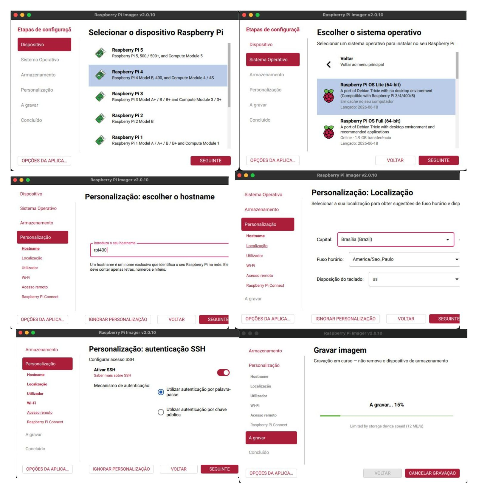
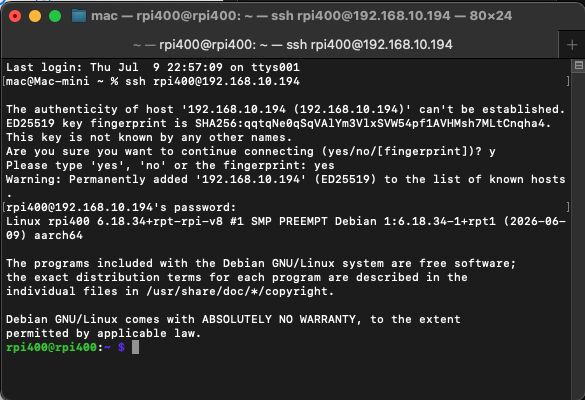
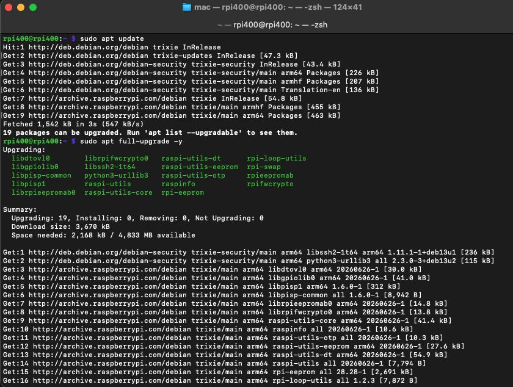
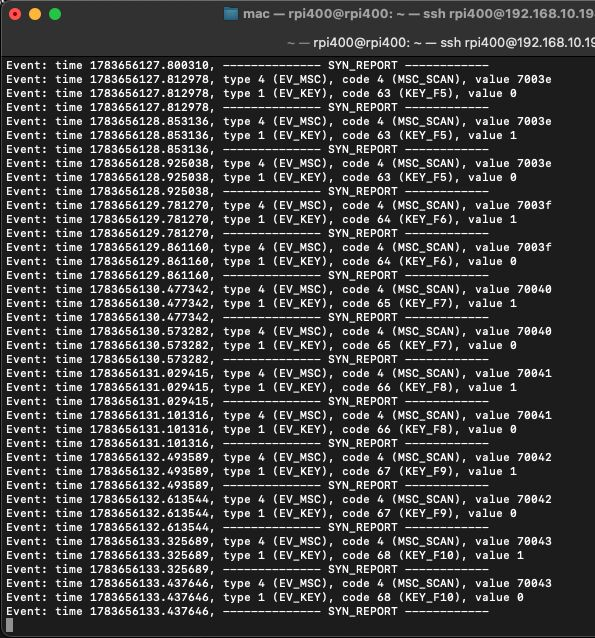
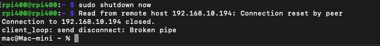

# Lab 1 - Primeira inicialização da Raspberry Pi 400

Objetivo

Realizar a primeira configuração da Raspberry Pi utilizando apenas o Raspberry Pi Imager.

## Hardware

Raspberry Pi 400


**/////IMAGEM RPI400**

Fonte USB-C oficial ou equivalente
Cartão microSD 8 GB
Rede Wi-Fi doméstica

## Software

Raspberry Pi Imager
Raspberry Pi OS Lite (64-bit)

## Configuração realizada

No Raspberry Pi Imager:

* Sistema operacional: Raspberry Pi OS Lite (64-bit)
* Hostname: rpI400
* SSH habilitado
* Autenticação por senha
* Wi-Fi configurado
* País do Wi-Fi


**/////IMAGEM IMAGER**

Ao gravar o cartão, o Imager já escreveu essas configurações na partição de boot, permitindo acesso remoto já na primeira inicialização.

## Ligando a Raspberry Pi:

* ligar a alimentação;
* aguardar cerca de 1 minuto;
* descobrir o IP que ela recebeu (Via DHCP do roteador; Usando ```arp -a```);

## Primeiro acesso

Depois de descobrir o IP:

ssh usuario@192.168.x.x


**//////IMG_ACESSO** 

## Script de reconhecimento do sistema

```bash
nano script1.sh
```

CTRL + O → salvar
CTRL + X → sair do editor

```bash
#!/bin/bash

# Script 1
# Reconhecimento do sistema

ARQUIVO="rp400_$(date +%Y-%m-%d_%H-%M-%S).txt"

{
echo "====================================================="
echo " Raspberry Pi 400 - LAB 01"
echo " Data: $(date)"
echo "====================================================="
echo

echo "===== HOSTNAME ====="
hostnamectl
echo

echo "===== KERNEL ====="
uname -a
echo

echo "===== SISTEMA OPERACIONAL ====="
cat /etc/os-release
echo

echo "===== CPU ====="
cat /proc/cpuinfo
echo

echo "===== MEMÓRIA ====="
free -h
echo

echo "===== DISCO ====="
lsblk
echo

echo "===== ESPAÇO EM DISCO ====="
df -h
echo

echo "===== TEMPERATURA ====="
vcgencmd measure_temp
echo

echo "===== THROTTLING ====="
vcgencmd get_throttled
echo

echo "===== ENDEREÇOS DE REDE ====="
ip a
echo

echo "===== ROTAS ====="
ip route
echo

echo "===== DNS ====="
cat /etc/resolv.conf
echo

echo "===== USB ====="
lsusb
echo

echo "===== PROCESSADOR ====="
lscpu
echo

echo "===== UPTIME ====="
uptime
echo

echo "===== DATA/HORA ====="
timedatectl
echo

echo "===== USUÁRIOS LOGADOS ====="
who
echo

echo "===== VERSÃO DO PYTHON ====="
python3 --version
echo

echo "===== FIM DO RELATÓRIO ====="

} > "$ARQUIVO"

echo
echo "Relatório salvo em: $ARQUIVO"
```

Copiar relátorio via scp pelo host

```bash
scp USER@IP_DO_RPI:~/FILE_NAME.txt
```

## Atualizar sistema

sudo apt update
sudo apt full-upgrade -y
sudo reboot


**/////IMAGEM UPDATE**

Depois reconecte via SSH.

## O sistema Linux de arquivos

Linux organiza todo o sistema a partir da raiz /. Diretórios possuem funções específicas e o usuário normalmente trabalha dentro da sua pasta pessoal (~).

Comandos úteis para primeira navegaçao:

```ascii
+-------------+------------------------------------------------+----------------------+
| Comando     | Descrição                                      | Exemplo              |
+-------------+------------------------------------------------+----------------------+
| pwd         | Mostra o diretório atual                      | pwd                  |
| ls          | Lista arquivos e diretórios                   | ls                   |
| ls -la      | Lista arquivos ocultos com detalhes           | ls -la               |
| cd          | Entra em um diretório                         | cd pasta             |
| cd ..       | Volta um nível na árvore de diretórios        | cd ..                |
| cd ~        | Retorna para a pasta pessoal                  | cd ~                 |
| mkdir       | Cria um novo diretório                        | mkdir labs           |
| touch       | Cria um arquivo vazio                         | touch teste.txt      |
| rm          | Remove arquivos                               | rm teste.txt         |
+-------------+------------------------------------------------+----------------------+
```

Instalar tree para 

##  Primeiro programa Python

Cria o workspace

```bash
mkdir -p ~/workspace/rpi400/labs/lab01
cd ~/workspace/rpi400/labs/lab01
```

Criar script com ```nano hello.py```

```python
print("Olá, mundo!")
print("Meu primeiro programa executando no Raspberry Pi 400")
```

## Instalar ncdu

```sudo apt install ncdu```

```ncdu ~```

navegar com setas, enter, ```b``` abrir shell no diretório atual e ```?``` para mais informações e ```q``` para sair.

## Teste o teclado headless

Ferramenta evtest, que permite visualizar os eventos de entrada recebidos pelo kernel Linux. Ela possibilita verificar dispositivos como teclados e outros periféricos sem a necessidade de interface gráfica.

Via ssh:

```sudo apt install evtest```

```sudo evtest```

O comando exibirá a lista de dispositivos de entrada disponíveis. Selecionar o dispositivo correspondente ao teclado integrado da Raspberry Pi 400.

Após a seleção, pressionar teclas no teclado exibirá os eventos detectados pelo kernel, permitindo confirmar o funcionamento do hardware diretamente pelo terminal.

Para encerrar o programa Ctrl ^ C


**////// IMG EVTEST**

## Desligar o RPI400

A forma mais segura de desligar o Raspberry Pi 400 (principalmente rodando Raspberry Pi OS Lite via SSH) é sempre fazer um shutdown pelo sistema operacional, nunca simplesmente cortar a energia.

```sudo shutdown now```

Após a conexão SSH cair, aguarde uns 10–20 segundos. O Raspberry estará parado e você pode remover a fonte.


**/////IMAGEM DESLIGAR**

###### 10/07/2026

## Teste os GPIOs headless

Ferramenta `pinctrl`, disponível no Raspberry Pi OS, que permite consultar e configurar os pinos GPIO diretamente pelo terminal. Ela possibilita validar o funcionamento dos GPIOs sem a necessidade de interface gráfica ou de escrever programas.

Via SSH:

```bash
pinctrl
```

Para consultar um GPIO específico:

```bash
pinctrl get 17
```

Para configurar um GPIO como saída e alterar seu estado:

```bash
pinctrl set 17 op
pinctrl set 17 dh
pinctrl set 17 dl
```

Para retornar o pino ao modo de entrada:

```bash
pinctrl set 17 ip
```

Os comandos exibem e modificam o estado dos GPIOs em tempo real, sendo úteis para validar conexões e testar periféricos durante o desenvolvimento.

###### 11/07/2026
